# Edge-Driving-Monitor

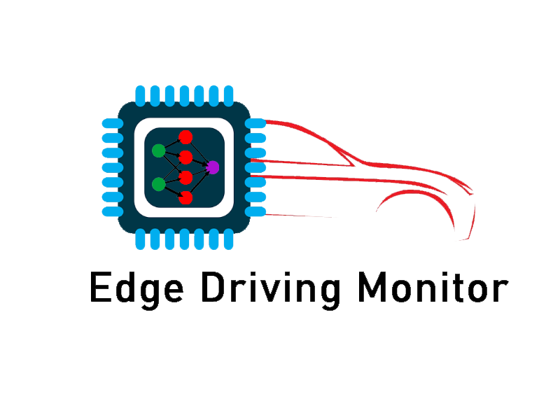

# Index
 
- [Edge-Driving-Monitor](#edge-driving-monitor)
- [Index](#index)
- [Introduction:](#introduction)
- [Solution:](#solution)
- [Materials:](#materials)
- [Connection Diagram:](#connection-diagram)
- [Edge Impulse:](#edge-impulse)
- [Arduino Setup and Sketch Compilation:](#arduino-setup-and-sketch-compilation)
- [Energy Consumption:](#energy-consumption)
- [M5 Display.](#m5-display)
- [Prototype Images:](#prototype-images)
- [EPIC DEMO:](#epic-demo)

# Introduction:

As a driver, it’s super important for you to know where the blind spots are on your own vehicle as well as other drivers' vehicles. Knowing this will help protect you and those around you from an easily-avoidable accident (no one wants to get sideswiped, really). 

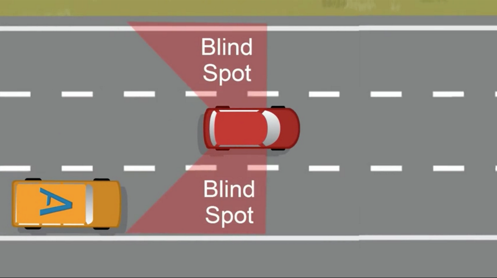

Blind spots are the areas to the sides of your car that can’t be seen in your rear mirror or side mirrors.

Apesar de ser muy notorio en camiones (1) los autos tambien tienen este tipo de puntos ciegos, los cuales pueden generar hasta 800,000 accidentes al año (2).

1. https://www.fmcsa.dot.gov/ourroads/large-blind-spots
2. https://www.natlawreview.com/article/what-if-my-car-accident-was-caused-blind-spot

# Solution:

We will create a system that will be able to detect small vehicles, pedestrians and motorcycles in the automobile’s blind spots.

Current Solutions:

- Mercedes-Benz Attention Assist uses the car's engine control unit to monitor changes in steering and other driving habits and alerts the driver accordingly.

- Lexus placed a camera in the dashboard that tracks the driver's face, rather than the vehicle's behavior, and alerts the driver if his or her movements seem to indicate sleep.

- Volvo's Driver Alert Control is a lane-departure system that monitors and corrects the vehicle's position on the road, then alerts the driver if it detects any drifting between lanes.

- Saab uses two cameras in the cockpit to monitor the driver's eye movement and alerts the driver with a text message in the dash, followed by a stern audio message if he or she still seems sleepy.

As you can see these are all premium brands and there is not a single plug and play system that can work for every car. This, is our opportunity as most cars in the road are not on that price range and do not have these systems.

# Materials:

Hardware:

- ESP32 Cam. [Link](https://www.amazon.com/dp/B07S4DRLYM/ref=cm_sw_em_r_mt_dp_GJTGMVVNSE5PY656G3JQ?_encoding=UTF8&psc=1)
- M5core2. [Link](https://shop.m5stack.com/products/m5stack-core2-esp32-iot-development-kit-for-aws-iot-edukit)

Software:

- Edge Impulse. [Link](https://www.edgeimpulse.com/)
- Arduino IDE. [Link](https://www.arduino.cc/en/software)

Project:

- EdgeDriverMonitor. [Link](https://studio.edgeimpulse.com/public/46428/latest)

# Connection Diagram:

This is the connection diagram of the system:

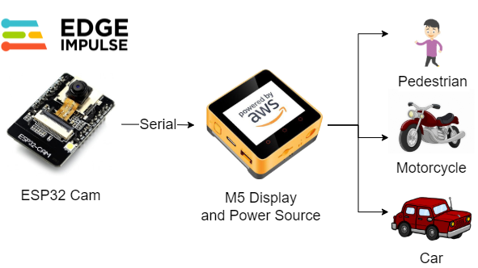

# Edge Impulse:

Para poder utilizar Machine Learning en un microcontrolador hay que decidir el framework a utilizar, en este caso se aprovecho el servicio ofrecido por [Edge Impulse](https://www.edgeimpulse.com/) para acelerar el desarrollo de la solucion.

Lo primero que debemos hacer es plantear que es lo que queremos detectar con nuestro modelo, en este caso serian carros, personas y motocicletas. Por lo tanto la primera etapa es obtener el dataset para alimentar al modelo.

El proyecto es publico, asi que puedes analizar el dataset y utilizarlo como gustes. [LINK](https://studio.edgeimpulse.com/public/46428/latest)

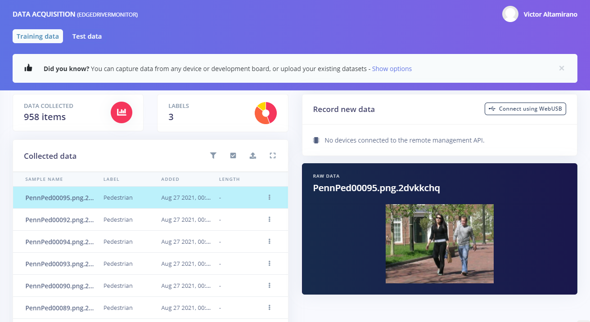

Para mi Impulse, subi 1224 imagenes en total, siendo 958 para train y 266 para test, con las labels Cars, Motorcycle and Pedestrians.

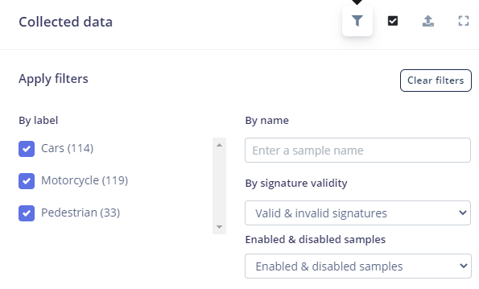

Lo siguiente sera configurar el Impuse que se va a crear, esto con el fin de poderlo leer desde la camara del ESP32 y poder mandarlo a la red neuronal.

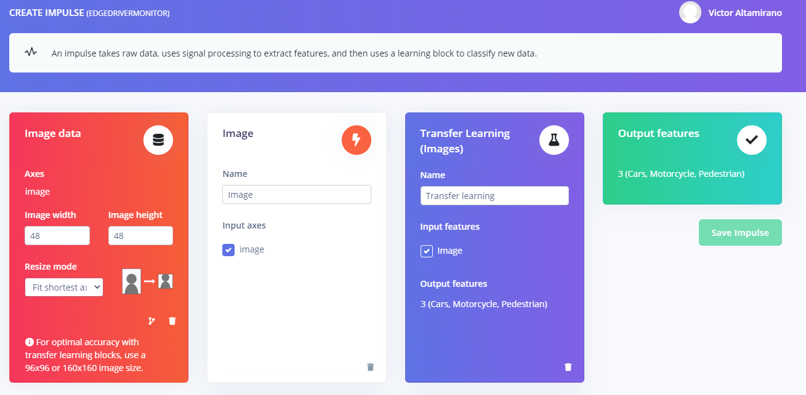

NOTA: NO CAMBIES ESTOS AJUSTES SI VAS A REPLICAR ESTE PROYECTO EN UN ESP32 CAM.

Ahora debemos pasar a la pestaña de Image y generar los features del modelo.

Parameters:
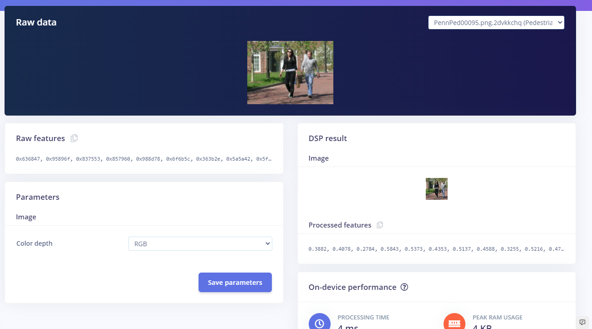
Features:
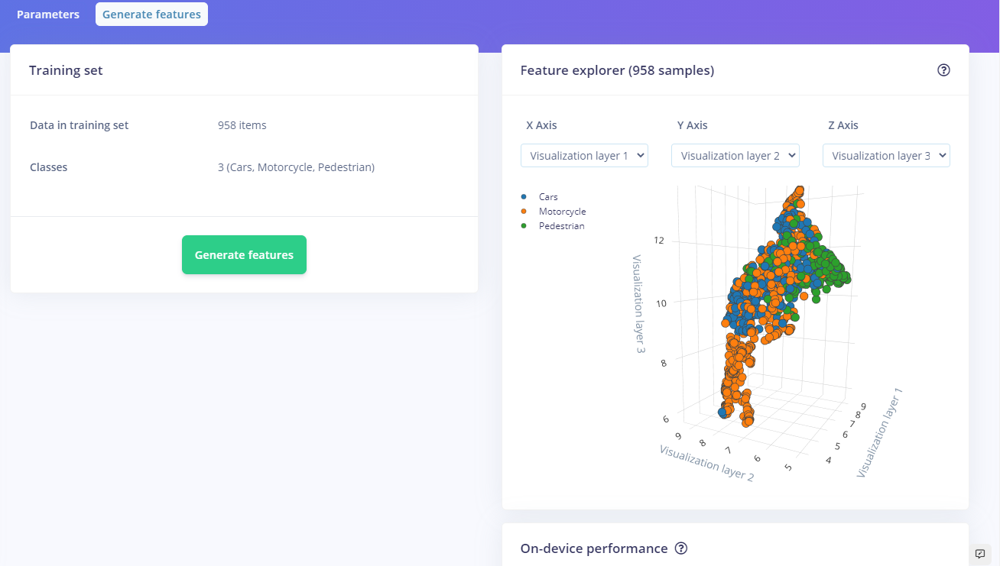

Ahora debemos configurar la red neuronal que va a ser entrenada con nuestros datos, en este caso Edge Impulse utiliza la tecnica de transfer learning para facilitar el entrenamiento de las redes, entonces para este ejemplo es conveniente utilizar una MobileNetV2 0.05

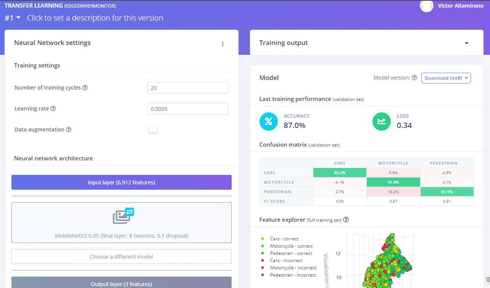

No olvides presionar el boton de Start Training.

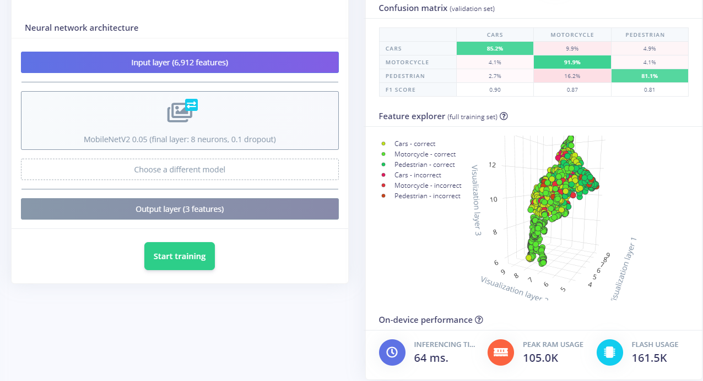

Recordar que tener una red que obtenga valores muy cercanos a 100% en entrenamiento puede ser una señalde overfitting de datos, asi que siempre evitar que ocurra esto, sin embargo para eso deberemos realizar el tesing del modelo en la pestaña de Model testing.

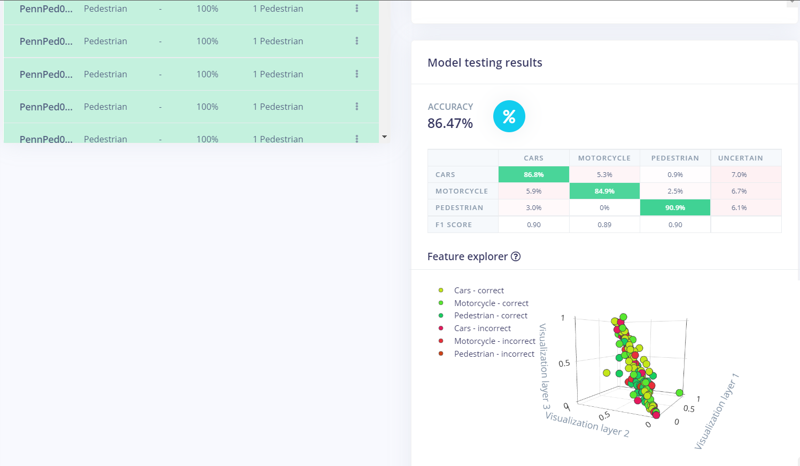

Ya por ultimo ya que vimos que el modelo funciona, no cae en overfitting ni underfitting, deberemos elegir el device donde vamos a desplegar el modelo para su utilizacion, ya que yo ocupo el modelo para ESP32 y usare el Arduino IDE, seleccionare de la lista esa libreria.

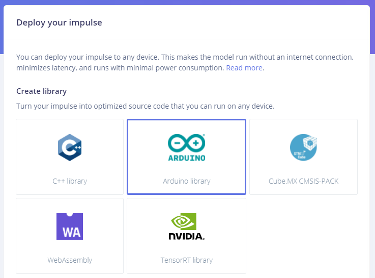

En la seccion de abajo podremos hacer el build y descargar el modelo, Edge Impuse recomienda dejar enable el EON Compiler, asi que justo asi lo dejaremos, sobre todo no olvides utilizar la opcion de Modelo Quantized para mejor rendimiento.

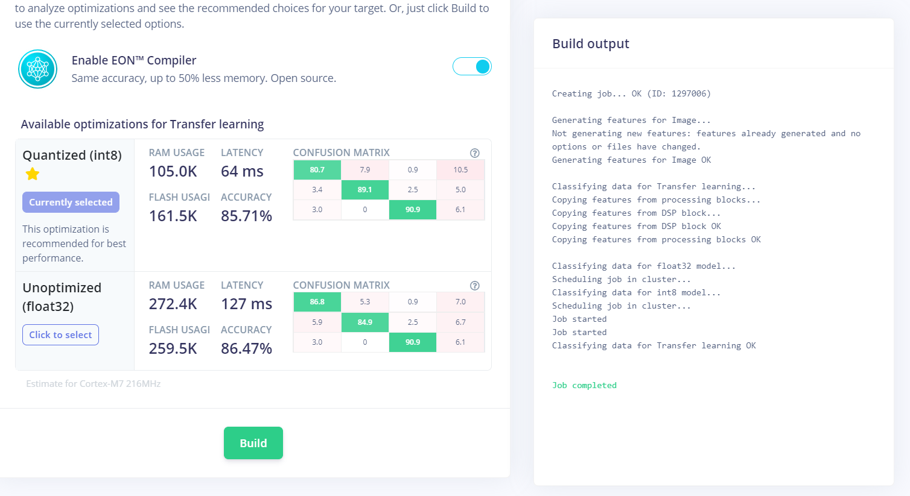

Ahora seguiremos las instrucciones para agregar el proyecto a Arduino IDE, puedes usar la version directamente desde Edge Impuse o utilizar la version [ei-edgedrivermonitor-arduino-1.0.3.zip](https://github.com/altaga/Edge-Driving-Monitor/blob/main/ei-edgedrivermonitor-arduino-1.0.3.zip) que yo utilice en mi proyecto.

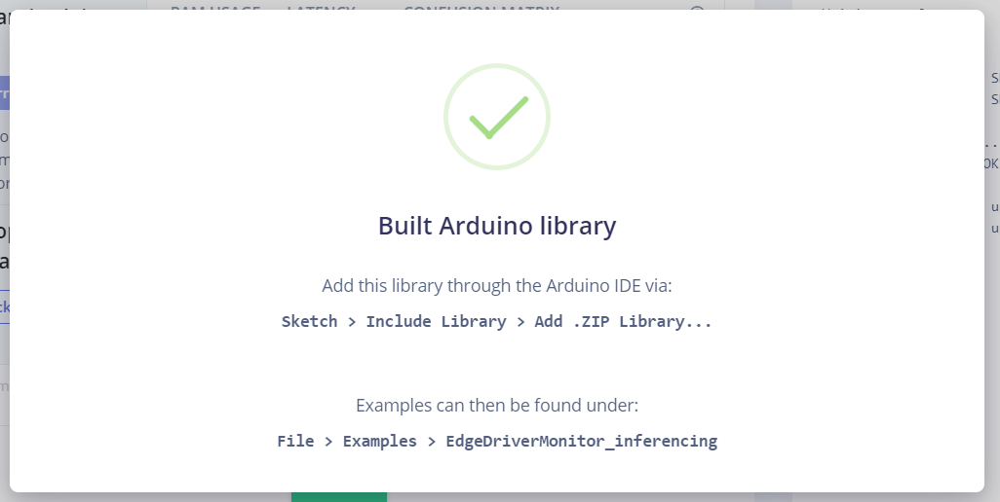

# Arduino Setup and Sketch Compilation:

Una vez tenemos la libreria descargada, abriremos el ejemplo en la carpeta [Edge_Impulse_ESP32_Cam](https://github.com/altaga/Edge-Driving-Monitor/tree/main/Edge_Impulse_ESP32_Cam), una vez abierto agregaremos la libreria .zip como se muestra en la imagen.

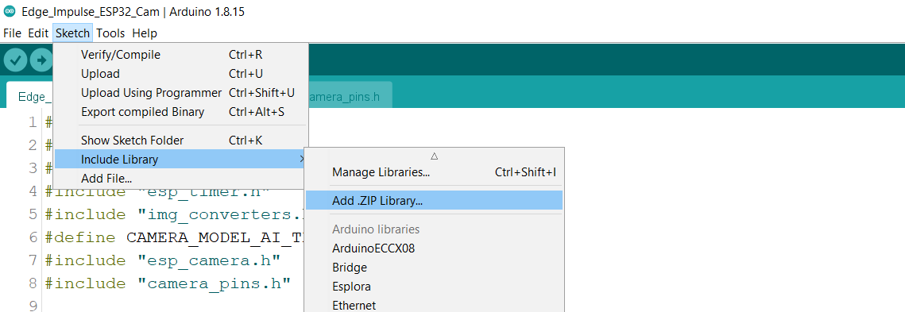

Una vez agregada la libreria, seleccionaremos la board correcta para la cual vamos a compilar, en este casi el ESP32 CAM.

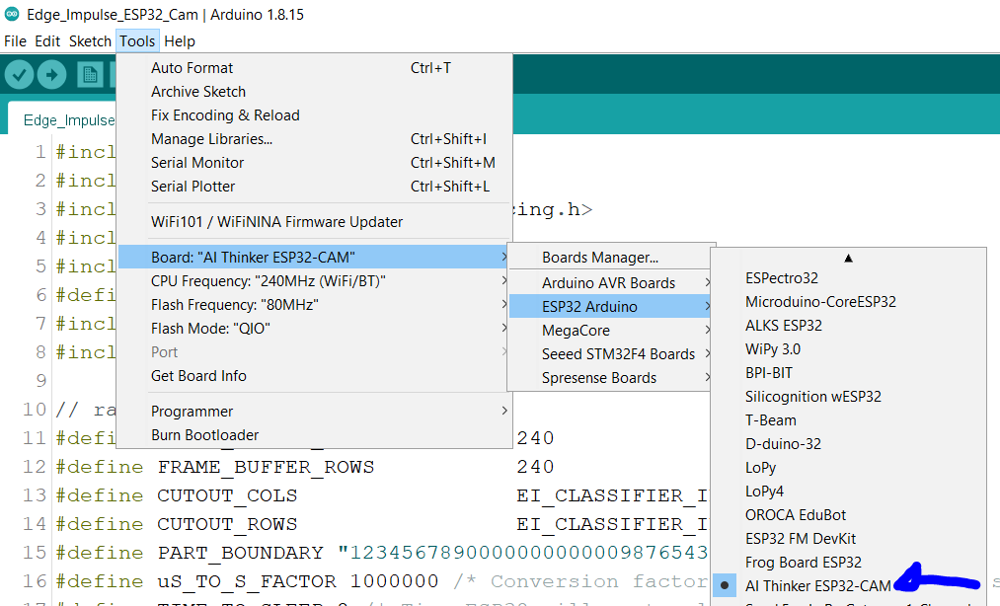

Ya seleccionada la placa ahora si seleccionar el puerto serial de la placa y flashear el codigo.

Si el compiladoo sale bien deberemos ver el siguiente resultado en el IDE.

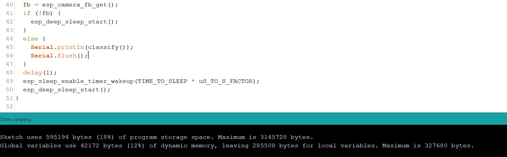

# Energy Consumption:

En el codigo se procuro cuidar el consumo de energia del ESP32 lo mas posible, asi que las consideraciones para mantener el consumo al minimo fueron:

1. Utilizar una red de inferencia como la que nos despliega Edge Impulse.
2. Mandar el microcontrolador a Deep sleep mientras no este relizando la inferencia en la red neuronal, el deep sleep se genera mediante timer y puedes bajarlo o subirlo segun tus necesidades, en mi caso el device se duerme por 2 segundos entre lecturas.

Aqui un analisis de la energia consumida por el device en 10 min, acelerare el video 10 veces para que puedas ver en 1 min todo el analisis, este analisis se realizo con el Power Profiler Kit II de Nordic.

Video: Click on the image

Sorry github does not allow embed videos.

Con este analisis podermos extrapolar el consumo energetico que seria de 50mAh, los datos del analisis estaran en el archivo [ppk-20210904T064657.csv](https://github.com/altaga/Edge-Driving-Monitor/blob/main/Data/ppk-20210904T064657.csv) para que puedas analizar el consumo mas a detalle.

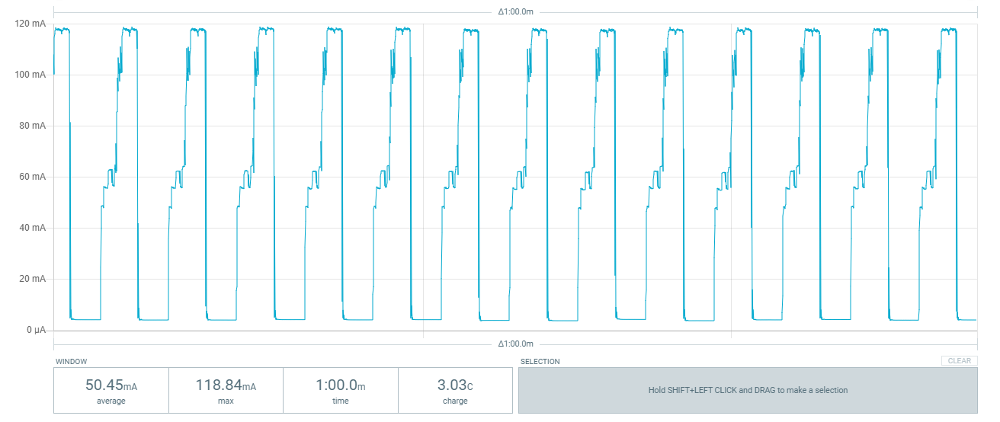

# M5 Display.

Como parte de la solucion se decidio que para mostrar los resultados de el device era necesario una pantalla o algun dispositivo con display, no es necesario utilizar una pantalla si no lo requieres, podria ser solo un LED y asi mantener aun mas bajo el consumo energetico, pero por fines demostrativos se utilizo el M5core2 y se utilizo la comunicacion serial para mandar los resultados desde el ESP32 al M5core2.

ESP32 Cam: Get Image, Analyze and Sleep.

    fb = esp_camera_fb_get();
    if (!fb) {
      esp_deep_sleep_start();
    }
    else {
      Serial.println(classify());
      Serial.flush();
    }
    esp_sleep_enable_timer_wakeup(TIME_TO_SLEEP * uS_TO_S_FACTOR); // 2 seconds
    esp_deep_sleep_start();

M5Core2: Display result.

    String serial = Serial2.readString();
    if (serial.indexOf("Start") != -1) {  // Filter Noise from ESP32 Cam Module Sleep
      flag = true;
    } 
    else if (flag) { // Convert Serial to Float Array
      serial = serial.substring(serial.indexOf("Star") + 4, serial.indexOf("Stop"));
      float array[3] = { serial.substring(0, serial.indexOf(",")).toFloat(), serial.substring(serial.indexOf(",") + 1, serial.indexOf(",", serial.indexOf(",") + 1)).toFloat(), serial.substring(serial.indexOf(",", serial.indexOf(",") + 1) + 1).toFloat() 
      };

La cominucacion como se indico se realizo por serial desde el ESP32 (GPIO3 RX and GPIO1 TX) a el PORTC (Serial2) del M5core2

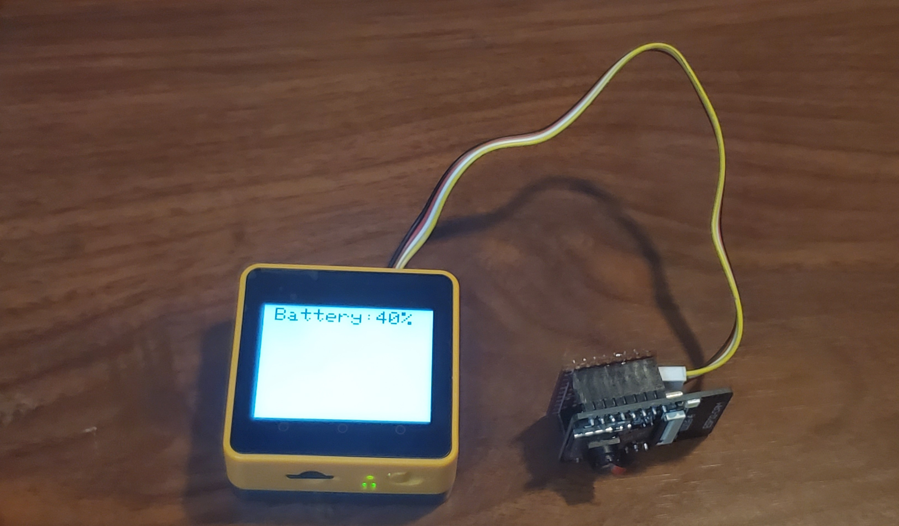

Realice algunas pruebas estaticas del device para poder asegurarme que la red funcionaba correctamente.

Car:
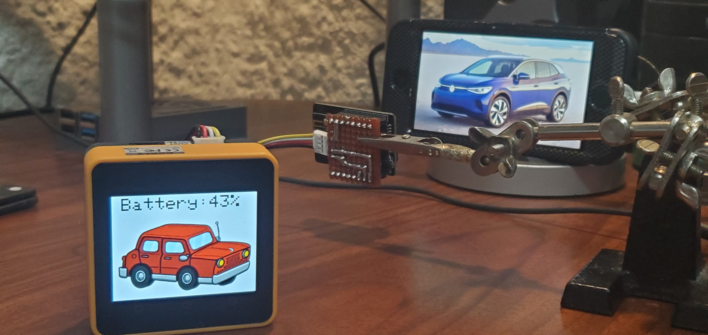

Pedestrian:
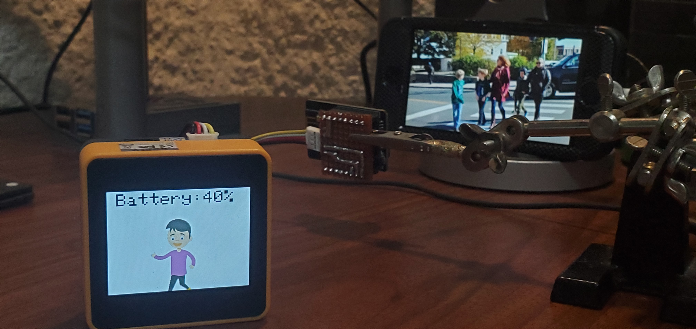

Motorcycle:
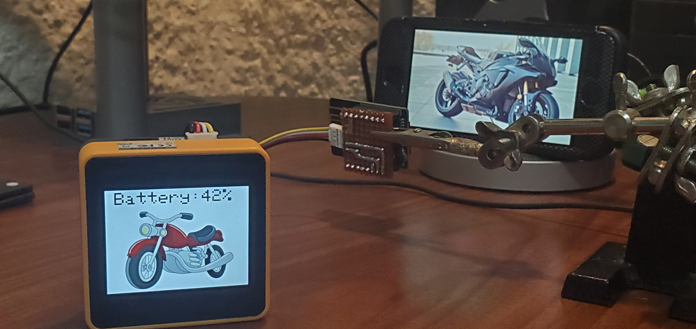

# Prototype Images:

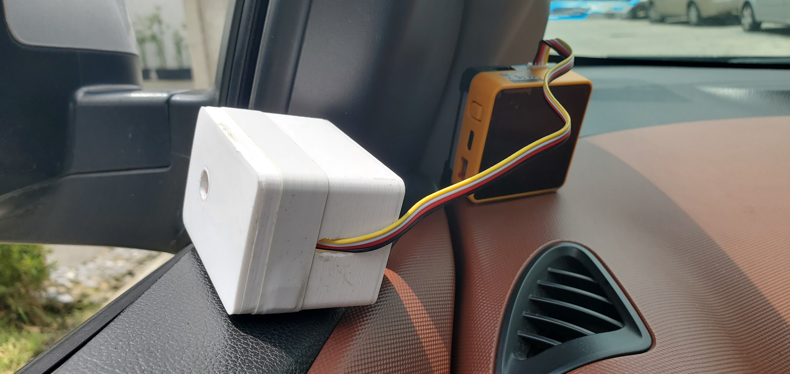

# EPIC DEMO:

